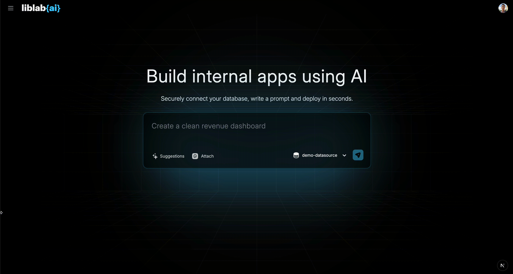
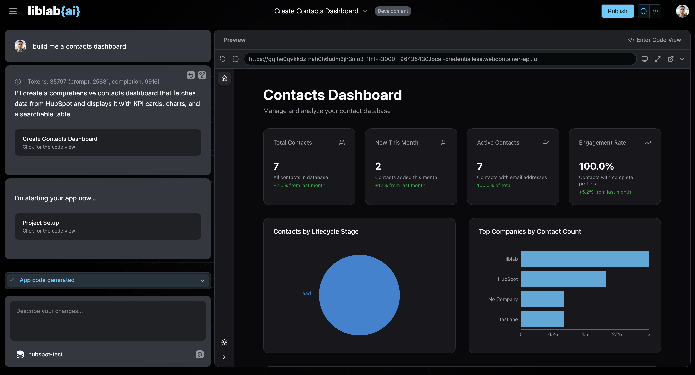

# HubSpot Data Source

This guide explains how to obtain a HubSpot **Access Token** for connecting HubSpot as a data source in **liblab.ai**.

---

## Steps to Get Your HubSpot Access Token

### 1. Create a Private App in HubSpot

1. Log in to your HubSpot account.
2. Go to **Profile & Preferences → Legacy Apps → Create → Private App for one account**.
3. Add a **name** and optionally a **logo** for your app.
4. Select the **scopes** needed for CRM functionality. Recommended scopes include:

- `crm.lists.read`
- `crm.lists.write`
- `crm.objects.companies.read`
- `crm.objects.companies.write`
- `crm.objects.contacts.read`
- `crm.objects.contacts.write`
- `crm.objects.deals.read`
- `crm.objects.deals.write`
- `crm.objects.goals.read`
- `crm.objects.goals.write`
- `crm.objects.leads.read`
- `crm.objects.leads.write`
- `crm.schemas.contacts.read`
- `crm.schemas.contacts.write`
  > ⚠️ Note: The capabilities of your built app in liblab.ai will depend on the scopes you select here.

5. Click **Create** to finalize the app.

For more details, see HubSpot’s official docs: [Private Apps Overview](https://developers.hubspot.com/docs/apps/legacy-apps/private-apps/overview)

---

### 2. Obtain the Access Token

1. Log in to your [HubSpot](https://www.hubspot.com/) account.
2. Go to **Profile & Preferences → Legacy Apps → select the app you created → Auth tab → copy access token**.  
   This is your access token.
3. Use this token when adding HubSpot as a data source in liblab.ai.

> ⚠️ Keep your Access Token secure — it provides direct access to your HubSpot account data.

---

## Connect HubSpot in liblab.ai

1. In liblab.ai, navigate to Control Panel → Data Sources → Add Data Source.
2. Select **HubSpot** from the list of data sources.
3. Paste your **Access Token** obtained from the previous steps.
4. Test the connection to ensure it works.
5. Save the data source.
6. Start building apps using your HubSpot data!

### Hubspot App Example 🚀

## OAuth Flow (Coming Soon)

Support for **OAuth-based HubSpot integration** will be available soon. This will allow secure, token-based connections without manually creating private apps.
